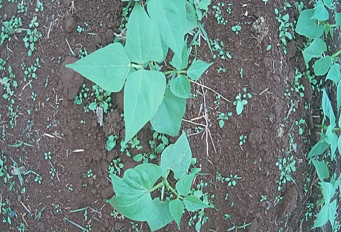
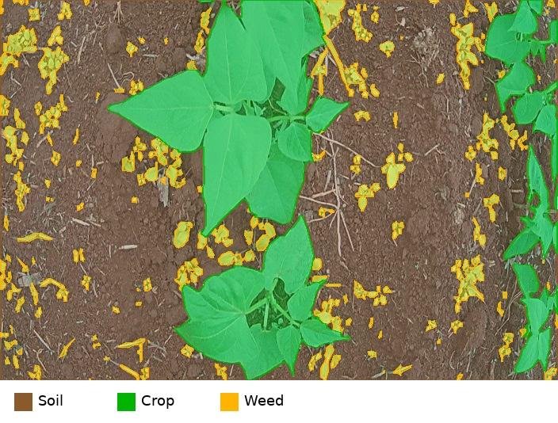
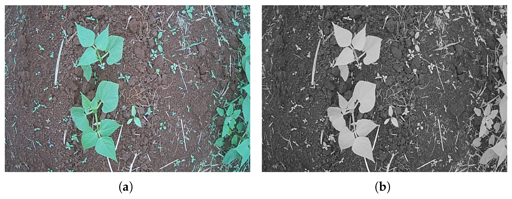

# Bean Dataset

Dataset for crop, weed, and soil segmentation in common bean fields.

This repository provides the Bean Dataset in COCO format, including RGB field images, segmentation annotations, predefined train/validation/test and 5-fold splits, metadata, and utility scripts.

The dataset was introduced in the paper:

**Low-Cost Robot for Agricultural Image Data Acquisition**  
*Agriculture*, 13(2), 413, 2023  
https://doi.org/10.3390/agriculture13020413

## Preview

| Original image | Segmentation overlay |
|---|---|
|  |  |

Example image from the Bean Dataset and the corresponding segmentation overlay for soil, crop, and weed.


Animated preview containing all dataset images in sequence.

## DARob Platform

The images in this dataset were collected using DARob, a low-cost agricultural robot developed for field image acquisition.


DARob hardware components and system organization.


DARob operating in the bean crop field during image acquisition.



Example of RGB field image and vegetation-index visualization from the original paper.

## About the Dataset

The Bean Dataset contains RGB images collected in common bean crop fields using DARob, a low-cost agricultural robot developed for field image acquisition.

The dataset was created to support research on agricultural image segmentation, especially for separating crop plants, weeds, and soil under real field conditions.

Images were collected in an experimental field at the School of Agricultural Engineering, University of Campinas, Brazil. The annotated images focus on early bean growth stages, when weed detection and crop monitoring are important for precision agriculture applications.

## Dataset Summary

| Item | Value |
|---|---:|
| Images | 228 |
| Image resolution | 704 x 480 pixels |
| Annotation format | COCO segmentation |
| Annotated instances | 697 |
| Classes | 3 |

## Classes

| ID | Class |
|---:|---|
| 1 | Soil |
| 2 | Crop |
| 3 | Weed |

## Class Distribution

The class distribution reported in the paper is:

| Class | Pixel area |
|---|---:|
| Soil | 75.10% |
| Crop | 17.30% |
| Weed | 7.58% |

## Repository Structure

```text
bean_dataset/
├── README.md
├── README.txt
├── LICENSE
├── CITATION.bib
├── annotations/
│   ├── instances.json
│   └── splits/
├── images/
├── splits/
├── docs/
├── metadata/
└── scripts/
```

## Annotation Format

Annotations are provided in COCO format.

Main annotation file:

```text
annotations/instances.json
```

Split-specific COCO annotation files are also available under:

```text
annotations/splits/
```

## Splits

This repository includes two split protocols.

### Train/Validation/Test

| Split | Images |
|---|---:|
| Train | 160 |
| Validation | 34 |
| Test | 34 |

Files:

```text
splits/train_val_test/train.txt
splits/train_val_test/val.txt
splits/train_val_test/test.txt
```

COCO annotations:

```text
annotations/splits/train_val_test/train.json
annotations/splits/train_val_test/val.json
annotations/splits/train_val_test/test.json
```

### 5-Fold Cross-Validation

| Fold | Train | Test |
|---|---:|---:|
| Fold 1 | 182 | 46 |
| Fold 2 | 182 | 46 |
| Fold 3 | 182 | 46 |
| Fold 4 | 183 | 45 |
| Fold 5 | 183 | 45 |

Files:

```text
splits/5fold/fold_1/train.txt
splits/5fold/fold_1/test.txt
...
splits/5fold/fold_5/train.txt
splits/5fold/fold_5/test.txt
```

COCO annotations:

```text
annotations/splits/5fold/fold_1/train.json
annotations/splits/5fold/fold_1/test.json
...
annotations/splits/5fold/fold_5/train.json
annotations/splits/5fold/fold_5/test.json
```

The split files were generated with a fixed random seed for reproducibility. They are provided for convenience and should not be interpreted as the exact splits used in the original paper unless explicitly stated.

More details are available in:

```text
docs/SPLITS.md
```

## Quick Check

To verify the dataset structure:

```bash
python scripts/verify_coco.py
```

To verify the split files:

```bash
python scripts/verify_splits.py
```

To load the COCO annotation file:

```bash
python scripts/example_load_coco.py
```

## Citation

If you use this dataset, please cite the original paper:

```bibtex
@article{vasconcelos2023lowcost,
  title = {Low-Cost Robot for Agricultural Image Data Acquisition},
  author = {Vasconcelos, Gustavo Jos{\'e} Querino and Costa, Gabriel Schubert Ruiz and Spina, Thiago Vallin and Pedrini, Helio},
  journal = {Agriculture},
  volume = {13},
  number = {2},
  article-number = {413},
  year = {2023},
  doi = {10.3390/agriculture13020413},
  url = {https://www.mdpi.com/2077-0472/13/2/413}
}
```

## License

This dataset is released under the license described in the `LICENSE` file.

## Reference

Gustavo José Querino Vasconcelos, Gabriel Schubert Ruiz Costa, Thiago Vallin Spina, and Helio Pedrini. Low-Cost Robot for Agricultural Image Data Acquisition. *Agriculture*, 13(2), 413, 2023. https://doi.org/10.3390/agriculture13020413